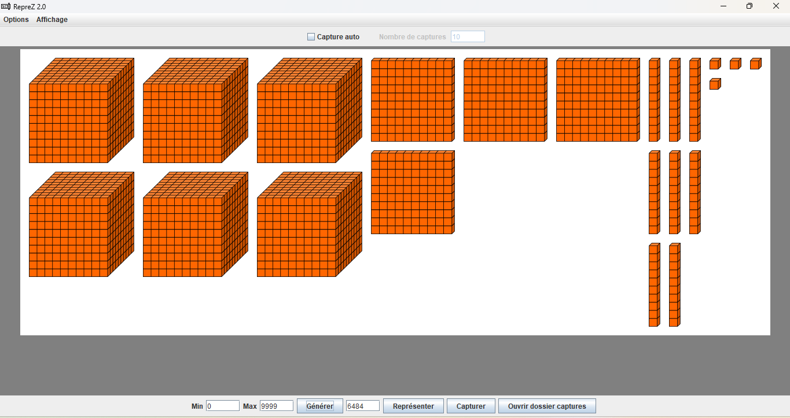

# RepreZ

RepreZ est une application éducative qui permet de représenter visuellement les nombres de 0 à 9999 à l'aide de blocs symbolisant les milliers, centaines, dizaines et unités. Cette méthode de représentation visuelle est particulièrement efficace pour l'apprentissage du système décimal et de la numération de position.


## Fonctionnalités

- **Représentation par blocs** : Visualisez les nombres sous forme de blocs colorés représentant les milliers, centaines, dizaines et unités
- **Génération aléatoire** : Générez des nombres aléatoires dans un intervalle défini
- **Capture d'écran intégrée** : Capturez les représentations pour créer des fiches d'exercices
- **Personnalisation des couleurs** : Choisissez parmi 9 schémas de couleurs différents (bleu, rouge, jaune, pourpre, vert, blanc, noir, rose, orange)
- **Mode plein écran** : Utilisez le mode plein écran pour les présentations
- **Génération automatique** : Créez rapidement un ensemble de représentations de nombres à l'aide de la fonction de capture automatique

## Installation

Téléchargez le fichier exécutable [RepreZ-2.0.exe](https://github.com/Zouhair2021/RepreZ/releases/latest) et lancez-le. Aucune installation supplémentaire n'est requise.

L'application crée automatiquement un dossier "RepreZ captures" dans le dossier "Images" de l'utilisateur pour stocker les captures d'écran générées.

## Utilisation

### Représentation simple
1. Saisissez un nombre entre 0 et 9999 dans le champ de texte
2. Cliquez sur "Représenter" pour visualiser le nombre
3. Utilisez "Capturer" pour enregistrer l'image dans le dossier des captures

### Génération aléatoire
1. Définissez les valeurs minimale et maximale pour l'intervalle
2. Cliquez sur "Générer" pour obtenir un nombre aléatoire dans cet intervalle
3. Le nombre est automatiquement représenté visuellement

### Capture automatique
1. Cochez "Capture auto" en haut de l'interface
2. Indiquez le nombre de captures souhaitées
3. Définissez l'intervalle min/max
4. Cliquez sur "Générer" pour lancer la génération et la capture automatique

## Structure du projet

```
RepreZ/
├── src/
│   ├── main/
│   │   ├── Main.java                 # Point d'entrée de l'application
│   │   ├── com/zouhair/
│   │   │   ├── PanDessin.java        # Panneau de dessin pour la représentation
│   │   │   └── RepNombres.java       # Interface principale et logique de l'application
│   │   └── resources/
│   │       ├── icons/                # Icônes de l'application
│   │       └── *.png                 # Images des blocs de différentes couleurs
├── .gitignore
├── README.md
└── LICENSE                           # Licence MIT
```

## Exemples




## Technologies utilisées

- Java
- Swing pour l'interface graphique
- BufferedImage pour la manipulation d'images

## Contribution

Les contributions sont les bienvenues ! N'hésitez pas à :
1. Fork le projet
2. Créer une branche pour votre fonctionnalité (`git checkout -b feature/amazing-feature`)
3. Commit vos changements (`git commit -m 'Add some amazing feature'`)
4. Push vers la branche (`git push origin feature/amazing-feature`)
5. Ouvrir une Pull Request

## Contact

- Facebook: [RepreZ](https://web.facebook.com/profile.php?id=61558486916972)
- WhatsApp: [+212659686664](https://wa.me/212659686664)

## Licence

Ce projet est sous licence MIT - voir le fichier [LICENSE](LICENSE) pour plus de détails.
